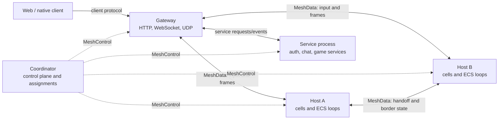
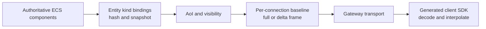

# Current Architecture

**Last verified:** 2026-07-13

MMOKIT is a server-authoritative multiplayer game framework. The reusable engine lives under `pkg/`; three examples under `examples/` consume it, the largest being a reference space game. Games normally import the `mmokit` facade rather than assembling engine packages directly.

The current implementation is 2D throughout. For project scope, goals, and planned direction — including first-class 3D support — see [`roadmap.md`](roadmap.md).

This page describes the current implementation. It is not a future design proposal.

The editable visual companion is [`architecture.excalidraw`](../architecture.excalidraw). Keep the diagram focused on durable relationships; this page remains the detailed narrative source of truth.

## Runtime topology

A `mmokit.Process` composes one or more open-set roles:

| Role | Responsibility |
| --- | --- |
| `coordinator` | MeshControl server, process registries, cell assignment, split/merge/migrate orchestration, and cluster admin state |
| `host` | Owns cells; every cell has its own ECS world, stage, and fixed-rate game loop |
| `gateway` | Terminates client HTTP, WebSocket, and optional UDP traffic; authenticates sessions and routes input/output to the owning host |
| `service` | Runs selected service kinds such as auth, chat, or game-defined services |

`--mode=all` is the development preset and includes all four roles. A service role is inert unless registered services are selected. Production can split the same game binary into independently deployed processes.

The coordinator is a control plane. Per-tick gameplay, replication payloads, and service events flow directly between gateways, hosts, and services rather than through it.

### Common deployments

| Deployment | Example invocation | Notes |
| --- | --- | --- |
| Single process | `--mode=all` | Coordinator, host, gateway, and service capability in one process; services still require selection/registration |
| Control plane | `--mode=coordinator` | Owns no cells unless combined with `host` |
| Remote host | `--mode=host --coordinator-addr=HOST:9100` | Registers with the coordinator and receives assignments |
| Standalone gateway | `--mode=gateway --coordinator-addr=HOST:9100` | Owns client listeners but no cells |
| Service process | `--mode=service --services=auth,chat --coordinator-addr=HOST:9100` | Runs selected registered service kinds |

The space example's distributed recipe and `examples/4node-basic` demonstrate concrete multi-process layouts:

- `just distributed-space`
- `cd examples/4node-basic && just distributed`

## Game composition

The normal game setup sequence is:

1. Construct `mmokit.Config` and call `mmokit.New`.
2. Register cell-local state factories with `mmokit.AddState`.
3. Register entity kinds, typed input/events/operations, handlers, and player lifecycle hooks.
4. Add systems in semantic execution order.
5. Register optional services, admin panels, and WASM systems.
6. Call `Process.Start`; explicit `Build` is only needed when callers must finish route/schema setup before listeners start.

See [`examples/simple/main.go`](../examples/simple/main.go) for the smallest composition and [`examples/space/internal/game/factory.go`](../examples/space/internal/game/factory.go) for the space game's system order.

## Per-cell simulation

Each owned cell contains an independent `Stage` backed by an Ark ECS world and `engine.GameLoop`. The default loop is 20 Hz and performs these broad phases:

1. Process connection lifecycle events and queued loop jobs.
2. Resolve pending player sessions.
3. Drain typed client input before gameplay systems.
4. Run registered systems in order, flushing deferred structural commands after each system.
5. Run replication and post-system hooks.
6. Flush authoritative removals and record metrics.

Game systems are single-writer: authoritative ECS mutation belongs on the cell-loop goroutine. Admin, service, and other off-loop work must route through `RunOnLoop`, typed commands, or another sanctioned queue.

### Entity presence

An entity's network ID can have these local representations:

- **Live:** authoritative and mutable on this cell.
- **Shadow:** destination-side warm state during authority transition.
- **Replica:** read-only border state owned by another cell.
- **Ghost:** non-authoritative transfer residue retained for protocol/lifecycle handling.

The NetID index and authority epoch protect the one-writer invariant. Bundle queries (`mmokit.Query`) exclude Ghost and Replica by default. Note that `ForEach1/2/3` do not: they iterate raw filters and can expose neighbour-owned replicas, including to WASM systems. Making all game-facing iteration default to authoritative live entities is tracked as CE-010 in [`roadmap.md`](roadmap.md).

### Spatial ownership and topology

World coordinates are absolute. A cell is a server-internal spatial partition identified by `cell_X_Y` or `cell_dN_X_Y`; clients do not need cell coordinates to render entities.

Hosts can own multiple cells. Dynamic partitioning uses quadtree splits and merges, while migration moves a cell between hosts. Player/entity boundary handoff uses authority epochs and a cluster commit tick so the destination promotion and source demotion share an ordering point.

## Replication and client protocol

Client traffic does not use protobuf. The client-facing protocol consists of:

- Typed reflection-codec messages for client input, server events, broadcasts, and request/response operations
- Quantized full snapshots and deltas for world replication
- Stable type IDs derived from registered Go types
- Generated TypeScript or C# clients produced from the assembled Go protocol schema
- An optional processed-input-sequence trailer on quantized frames, announced by `FrameFlagInputAck` ([`pkg/quantize/wireformat.go`](../pkg/quantize/wireformat.go)), which clients use to retire acknowledged predicted input
- An optional client-to-server `mmokit.ReplicationAck`; connections on a datagram transport advance their replication baselines on that acknowledgement rather than on transport acceptance

Channel `0x00` carries typed input/events and channel `0x01` carries operations. WebSocket and the custom UDP transport share the connection manager; [`pkg/net/README.md`](../pkg/net/README.md) is the authoritative reference for channel bytes and delivery classes. Remaining UDP security and gating work is tracked as CE-005b in [`roadmap.md`](roadmap.md).

Only server-internal MeshControl and MeshData traffic uses protobuf, with its schema in [`proto/meshpb/mesh.proto`](../proto/meshpb/mesh.proto).

### Replication path

Entity kinds are registered from component bundles. Their bindings define initial-only and changing fields, quantization, and optional custom codecs. The replication system queries spatial visibility per viewer, compares hashes, encodes full or delta payloads, and emits absolute-world state to the gateway/client.

## Messaging and operations

Use typed surfaces instead of ad-hoc frames:

| Need | API family |
| --- | --- |
| Client input | `mmokit.HandleClient[T]` |
| Server-to-client event | `mmokit.RegisterEvent[T]`, `SendEvent`, `SendEventToAll` |
| Entity/cell message | `mmokit.Handle`, `HandleAll`, `Entity.Send` |
| Request/response operation | `mmokit.RegisterOp`, `RouteGatewayLocal`, `RoutePlayerCell` |
| Operator mutation | `pkg/cmdsys` command and route |
| Cross-process service behavior | `pkg/service` kind plus MeshData routing |

The `All` registration variants replay handlers onto cells created later by splits or migrations. Stage-scoped variants should only be used when a handler is intentionally local to one existing cell.

## Persistence and world content

PostgreSQL is split by ownership:

- `pkg/persist` owns framework identity, sessions, admin operators, and shared engine migrations.
- An example's own persist package owns its game configuration, player state, and game migrations; the space example's is `examples/space/internal/persist`.
- Service packages can contribute their own migrations.

The space example opens one shared pool and constructs typed repositories around it. Its pure standalone gateways skip game persistence, while coordinator and host roles load the game configuration/state they need. In the generic framework, a service requires PostgreSQL only when its kind declares `RequiresDB`.

The space example's hand-authored world content lives in tracked JSON under `examples/space/world/` and is loaded through its own `internal/world/jsonrepo`. Runtime editor mutations use the world repository and command path so live state and disk remain synchronized.

## Observability and administration

- Gateway HTTP defaults to `:8080` for `/ws`, `/auth`, and gateway metrics/routes.
- Client UDP is experimental and disabled by default; enable with `--udp-listen=:9000`. Sessions are bound to a source address, but the framing is unauthenticated and unencrypted.
- MeshControl defaults to `:9100` on the coordinator. Both mesh channels run over in-memory TLS and authenticate peers with a shared cluster secret (`--cluster-secret` / `MMO_CLUSTER_SECRET`), auto-generated for self-contained role sets and required on every process of a multi-process cluster.
- Coordinator admin/metrics defaults to `:9101`; `/admin/` hosts the operator UI when enabled.
- Per-cell metrics cover tick timing, entity counts, connections, bytes, and border traffic.
- Typed `cmdsys` verbs back both the interactive console and admin dashboard.

Use TLS certificate flags or a TLS-terminating proxy in production. Self-signed TLS and insecure auth cookies are development options only for the client-facing listeners. The mesh channels are a separate posture: they always use an in-memory self-signed certificate and dial with `InsecureSkipVerify`, because peer identity comes from the cluster secret rather than from certificate verification.

## Package boundaries

| Area | Responsibility |
| --- | --- |
| `mmokit` | Public game-facing facade and high-level registration helpers |
| `pkg/universe` | Process roles, cells/stages, topology, handoff, mesh, services, integrity checks. A cell's `(MeshID, CellID)` identity is immutable behind an atomic swap — read it via `Cell.MeshID()` / `Cell.CellID()`, or `Cell.Identity()` when both halves must agree |
| `pkg/engine` | ECS loop, systems, players, loop jobs, console foundations |
| `pkg/system` | Reusable physics, lifetime, spatial, replication, and debug systems |
| `pkg/net`, `pkg/ops` | Client transports, connection management, and operation routing |
| `pkg/replication`, `pkg/quantize` | Baselines, frame primitives, quantization, delta encoding, and the shared TypeScript client cores in [`pkg/quantize/ts/`](../pkg/quantize/ts/) — delta decoding, interpolation, clock sync, adaptive playback, prediction buffering, and reconciliation pairing |
| `csharp/Mmokit.Sdk.Core` | Hand-ported C# counterparts of those cores, copied into generated SDKs by `cmd/sdkgen` |
| `pkg/cmdsys`, `pkg/admin` | Routed operator commands and dashboard backend |
| `pkg/service`, `pkg/services` | Service runtime and built-in service kinds |
| `examples/space/internal/{game,component}` | Space-game systems, entities, rules, and components |
| `examples/space/main.go` | Space-game composition root |

Reusable packages must not import an example. Each example keeps its game code under its own `internal/` directory, so the compiler rejects such an import rather than a convention forbidding it. Game logic uses MMOKIT APIs and keeps direct Ark ECS access in framework/binding glue.

## Known work

[`roadmap.md`](roadmap.md) tracks all active correctness, security, scalability, and protocol work, with each item's status verified against source. In particular, this page should not be read as claiming that UDP transport security is complete — it remains an open P0 item, and the UDP framing is still unauthenticated. Mesh authentication is closed, with one documented limitation: the cluster secret is shared rather than per-peer, so it excludes outsiders but does not prevent one authenticated member from impersonating another.
